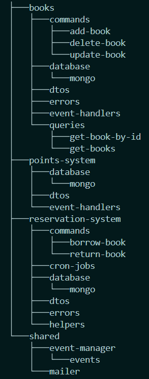

<h1 align="center">📖 Book Library Tool 📖</h1>

<p align="center">
  A simple and clean Book Library Tool to borrow books
</p>

## 🫡 Introduction

The Royal Library of Belgium would like to have a tool to easily manage their stock and allow customers to browse and reserve books online. The library currently has many references and users.

Among the features included in this tool, you can find management of all books and references, catalog search, reservation and borrowing system, notifications on the status of their loans for users, and a points system that rewards users who comply with the deadlines.

## 📦 Prerequisites

1. [Node.js](https://nodejs.org/) - version 18.17.1 or higher
2. [npm](https://www.npmjs.com/) - version 10.7 or higher
3. [Docker Engine and Docker Compose](https://docker.com/) - version 24 or higher
4. [Git](https://git-scm.com)

## 😎 Getting Started

To get started, follow these steps:

1. Clone the project repository
   ```sh
   git clone https://github.com/carmona44/knowledge-store.git
   ```
2. Install the dependencies
   ```sh
   npm install
   ```
3. You need to create your .env file, you can create a copy from the example one:
   ```bash
   cp .env.example .env
   ```
4. Start MongoDB container. This will automatically run the seeds as defined in `./docker/seed/`
   ```sh
   docker compose up -d
   ```
5. Start the application in development and watch mode
   ```sh
   npm run dev
   ```

## 👨‍🚀 Postman Collection

To help you with testing, I have created a Postman collection. To use it, import the `book-library-tool.postman_collection.json` file into Postman.

> [!WARNING]
> Currently, there isn't a user module, so please note that when reserving a book, the user's email is assumed as their identifier.

## ✅ Testing

To run all the present tests (keep in mind that the tool is not entirely tested):

```bash
npm run test
```

## 🫘 Rerunning the Seeds

The seeds defined in `./docker/seeds/` are only run once when the database container is started for the first time. If you want to rerun the seeds, you can do so by running the following command (this will also reset the database):

```sh
docker compose down && docker compose up -d
```

## ⚙️ Building

```bash
npm run build
```

## 📂 Project structure



In developing this project, priority has been given to having a good architecture and following best practices and clean code so that implementing new features in the future will be easier.

The project is based on `Clean Architecture`, `Event-Driven Architecture` and a `Command Query Responsibility Segregation (CQRS)` structure.

The image depicts the file structure of `src`. At the same level, there's the `tests` folder, which follows the same structure as src.

## ⏭️ Next steps

- [ ] Use pagination for listings (skip/limit or cursor/pointer-based)
- [ ] Add tests for everything (unit, e2e)
- [ ] Add user module
- [ ] API versioning
- [ ] Add security (helmet / jwt / auth)
- [ ] Implement Dependency Injection (DI)
- [ ] Add validations (joi, zod, class-validator)
- [ ] Add CI/CD (jenkis or github actions)
- [ ] Document the API (swagger)
- [ ] Add linters and code formatters
- [ ] Refactors and little improvements
